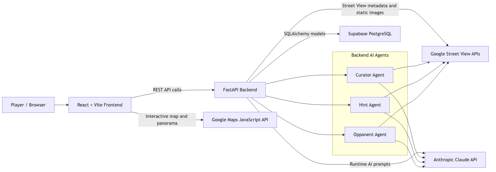
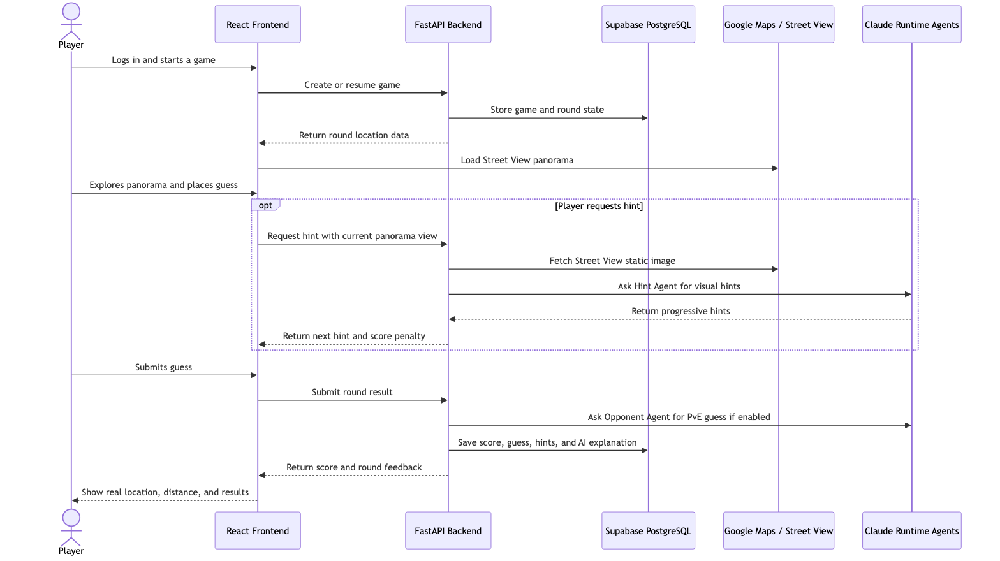
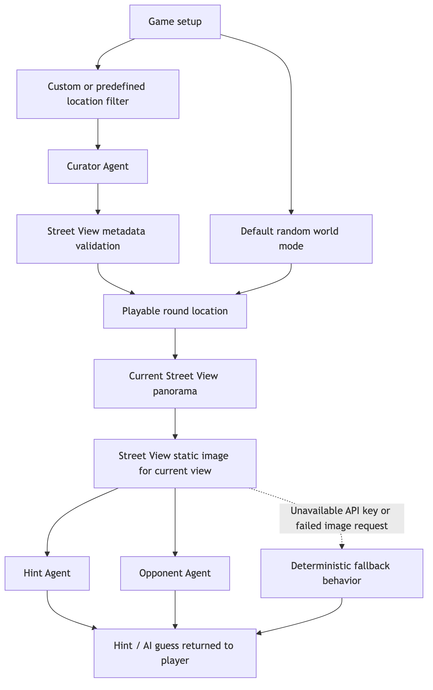
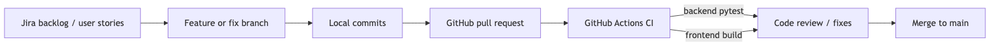
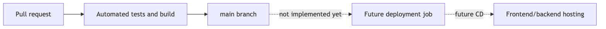

# AIm Here Diagrams

This document contains the project diagrams used for the software development process and implementation presentation. The diagrams are exported as PNG images and the editable Mermaid sources are stored next to them in `docs/diagrams/`.

## Component Architecture

Source: [`component-architecture.mmd`](./diagrams/component-architecture.mmd)

## Gameplay Workflow

Source: [`gameplay-workflow.mmd`](./diagrams/gameplay-workflow.mmd)

## AI Agent Data Flow

Source: [`ai-agent-data-flow.mmd`](./diagrams/ai-agent-data-flow.mmd)

## Source Control And CI Workflow

Source: [`source-control-ci-workflow.mmd`](./diagrams/source-control-ci-workflow.mmd)

## Deployment Gap

Source: [`deployment-gap.mmd`](./diagrams/deployment-gap.mmd)

The current repository implements CI through GitHub Actions. A complete CI/CD workflow still needs an automatic deployment step after successful checks on `main`.
